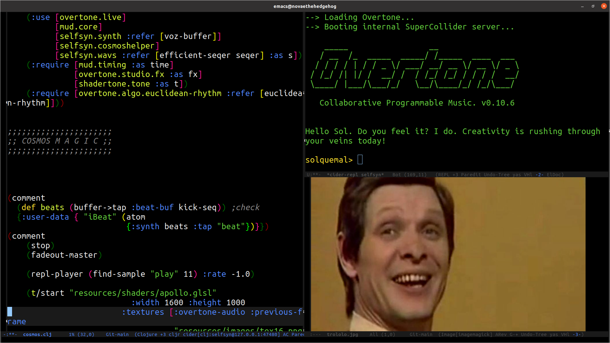

# SELFSYN

`SELF` synthesis by creating audio visual content with Clojure

Uses:
-[emacs live](https://overtone.github.io/emacs-live/)
-[overtone](https://github.com/markus-wa/overtone)
-[shadertone](https://github.com/markus-wa/shadertone)

For building locally:
- Run `lein repl`
check java version: I had to target different version: OpenJDK Runtime Environment (build 1.8.0_275-8u275-b01-0ubuntu1~20.04-b01)
- From emacs environment run `cider-connect`. Default configruation is set to localhost and port `47480`

**cosmos** DEMO:

Special thanks to [markus-wa](https://github.com/markus-wa)

